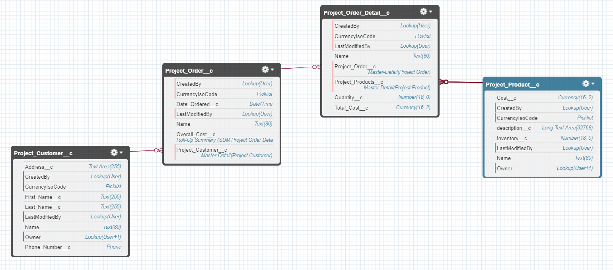

## Project
For this project the project order detail and project order will not act a cart but as a receipt. This makes changing quanitiy and cost a lot easier to deal with and a lot less complex.

Schema View:


### Getting Started:
Seems you can't export/import objects so you need to:
1. Create the Objects with fields as seen in pic
2. Add layout fields for easy GUI use 
3. Create Workflow Rule (Get Overall cost working on Project Order)
- `create` -> `Workflow & Approvals` -> `Workflow Rules` -> `New Rule` -> on `Project Order Detail ->` -> give name like `Total Cost Sum` -> for field use `Project Order Detail: Quantity` opertaor `greater than` value `-1` the `save`-> `add workflow actions` -> Give name and forumla as `Quantity__c  *  Project_Products__r.Cost__c`, then activate it
4. Create Custom Tabs of objects to use GUI to populate and see and manipulte data easily. `Create` -> `Tabs`.
5. Your environment should be good.

### What's finished:
- All objects were created
- A Workflow rule was made

### What still needs to be finished:
- Apex class for Project Order, Project Order Details, Project Products
- Trigger on Order detail for quantity
- Validation on what the user can input
- APEX code so basic business stuff works correctly. Like inventory goes down/up when something happens.

### My examples for Project Customer object:
- Add Customers through execute anonymous window (or use tabs):
```
Project_Customer__c customerToAdd = new Project_Customer__c();
customerToAdd.First_Name__c = 'June';
customerToAdd.Last_Name__c = 'Morgan';
customerToAdd.Address__c = '123 street rd.';
customerToAdd.Phone_Number__c = '123-123-1234';
customerToAdd.Name = 'June Morgan'; // unsure if this is also a unique identifer or just the actual name of the entry
insert customerToAdd;
System.debug('customerToAdd recordID is: ' + customerToAdd.id);
```
- An APEX class for Project Customers:
```
public class ProjectCustomerManager {
    public static ID addProjectCustomer(String lastNameToInsert, String firstNameToInsert, String addressToInsert, String phoneToInsert, String NameToInsert) {
        Project_Customer__c customerToAdd = new Project_Customer__c(First_Name__c=firstNameToInsert, Last_Name__c=lastNameToInsert, Address__c=addressToInsert, Phone_Number__c=phoneToInsert, Name=NameToInsert);
        insert(customerToAdd);
        System.debug('customerToAdd recordID is: ' + customerToAdd.Id);
        return customerToAdd.Id;
    }
}
```
- Add customers with the APEX class method addProjectCustomer:
```
ID projectCustomerID = ProjectCustomerManager.addProjectCustomer('Rehman','Areil', '1234 Street','321-321-4321','Rehman Areil');
System.debug('Called from Execute Anonymous: ID is ' + projectCustomerID);
```
- Test duplicates on project customers: Creates test data (createTestDataProjectCustomers) and finds of duplicates (testFindDuplicates)
```
@isTest
private class ProjectCustomerManager_Test {

    private static List<Project_Customer__c> createTestDataProjectCustomers(Integer startValue, Integer endValue) {
        List<Project_Customer__c> customerToAdd = new List<Project_Customer__c>();
        for (Integer i=startValue; i <= endValue; i++) {
            Project_Customer__c customer = new Project_Customer__c(First_Name__c='TestFirst' + i, Last_Name__c='TestLast' + i, Address__c='TestAddress' + i, Phone_Number__c='TestPhone' + i, Name='TestName' + i);
            customerToAdd.add(customer);
        }
        return customerToAdd;
    }

    static testMethod void testFindDuplicates () {
        List<Project_Customer__c> oldCustomers = createTestDataProjectCustomers(0, 5);
        List<Project_Customer__c> newCustomers = createTestDataProjectCustomers(3, 6);
        Test.startTest();
        Set<Project_Customer__c> duplicateCustomers = ProjectCustomerManager.findDuplicates(oldCustomers, newCustomers);
        Test.stopTest();
        System.assert(duplicateCustomers.size()==3);
    }
}
```
- Added Method (findDuplicates) to the ProjectCustomerManager class for the test:
```
public class ProjectCustomerManager {

    public static ID addProjectCustomer(String lastNameToInsert, String firstNameToInsert, String addressToInsert, String phoneToInsert, String NameToInsert) {
        Project_Customer__c customerToAdd = new Project_Customer__c(First_Name__c=firstNameToInsert, Last_Name__c=lastNameToInsert, Address__c=addressToInsert, Phone_Number__c=phoneToInsert, Name=NameToInsert);
        insert(customerToAdd);
        System.debug('customerToAdd recordID is: ' + customerToAdd.Id);
        return customerToAdd.Id;
    }

    public static Set<Project_Customer__c> findDuplicates (List<Project_Customer__c> oldCustomerList, List<Project_Customer__c> newCustomerList) {
        Set<Project_Customer__c> projectCustomerSet = new Set<Project_Customer__c>();
        Set<Project_Customer__c> oldCustomerSet = new Set<Project_Customer__c>(oldCustomerList);
        for (Project_Customer__c newCustomer : newCustomerList) {
            if (oldCustomerSet.contains(newCustomer)) {
                projectCustomerSet.add(newCustomer);
            }
        } 
        return projectCustomerSet;
    }
}
```
- SOQL query for Project Customers Object:
```
SELECT Id, Name, First_Name__c, Last_Name__c, Phone_Number__c, Address__c FROM Project_Customer__c
```
- Trigger on Project Customers Object to not allow area-code 555 during insert/update:
``` 
trigger ProjectCustomerTrigger on Project_Customer__c (before 
    insert,  before update) {
    if (trigger.isBefore) {
        if (trigger.isUpdate || trigger.isInsert) {
            for (Project_Customer__c pc :trigger.new) {
                if (pc.Phone_Number__c.substring(0,5) == '(555)') {
                    pc.addError('Invalid area code');
                }
            }
        }
    }
}
```